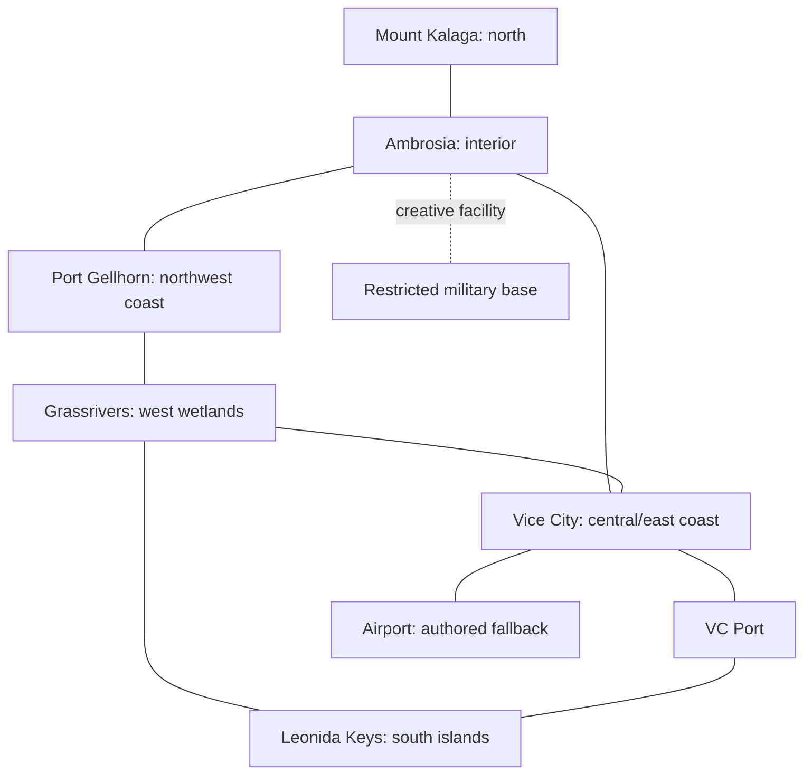

# Leonida reconstruction atlas

Plan version **0.1**, 2026-09-09. This atlas establishes a connected authored interpretation while official map measurements remain unavailable. **It is not an exact GTA VI map.** The initial neighborhood is a development area; the other five regions remain required scope. Names and thematic observations refer to [references.md](references.md); all numerical values here are **project decisions**.

## Coordinate and scale contract

- Babylon local frame: **+X east, +Y up, +Z north**; one unit = one meter; seconds and kilograms for simulation. World origin is an authored central Vice City neighborhood junction, not a claimed GTA VI location or geodetic point.
- The central work envelope is X **−230…155**, Z **−252…252**. Beach and coastal transition extend east to X **210**; ocean begins beyond X **210**. Boundaries are implementation planning coordinates, not surveyed shorelines.
- Initial connected street axes: X **−144, −72, 0, 72, 144**; Z **−216, −144, −72, 0, 72, 144, 216**. The 72 m pitch establishes compact local blocks. Branch roads, alleys and authored landmarks must break repetition.
- Keep ground-level scale 1:1: lane width **3.3 m**, local two-way carriageway **6.6–8 m**, curbs **0.15 m**, sidewalks **2.5–4 m**, marked crossings **3 m**, minimum alley clear width **3 m**, doorway clear width **1 m**, floor height **3.2 m**, shop floor height **4 m**. Buildings may vary; these are defaults, not zoning claims.
- Do not globally scale down individual roads, cars, people, doors or stairs to compress travel. Keep detailed district coordinates metric. Regional connector length compression can be introduced by a documented piecewise transform; this version uses **authored distances**, with no claim of a geographic compression ratio.
- Sea level baseline **Y=0 m**. Choose dry central roadway elevation **1–3 m** consistently with the world implementation. Physics geometry, water tests and map display must share the final datum.
- Chunk proposal: **144 m × 144 m**, deterministic integer addresses, stable authored IDs. The physics/navigation active radius and graphical LOD are separate. Loaded terrain alone is not completed district coverage.

## Overall regional envelope

These centers and footprints are **planned, unbuilt, low-confidence placement**. A rectangular footprint means reserved work area, not official region boundary. Preserve topology while refining shorelines. If an initial preview marker uses shorter distances, label it a preview and record the difference; a marker does not replace the region.

| Region / district ID | Planned center X,Z (m) | Reserved footprint W×D | Evidence/confidence | Connections and completion target |
|---|---:|---:|---|---|
| VC-CENTRAL | 0, 0 | 385×504 m initial work envelope | Official city theme; authored grid, low geographic confidence | Complete central walk/drive/crash/witness/pursuit/recovery loop; multiple road and pedestrian escape paths |
| VC-BEACH | 170, 0 | 70×700 m | Coastal visual reference; exact coastline authored | Promenade, swim access, lifeguard towers, hotels, beach activity; connect north/south continuously |
| VC-INNER | −650, 150 | 900×900 m | VI named district themes, authored layout | Commercial/residential transition, market, cafes, garages, alleys; western arterial connects wetlands and airport |
| VC-DOWNTOWN | −500, 1200 | 1100×1200 m | Tower skyline observed; placement authored | Towers, waterfront roads, transit/rail provision, varied intersections, dense pedestrian destinations |
| VC-PORT | −300, −900 | 1000×650 m | Official port identity; footprint authored | Industrial yards, docks, container lanes, cruise-side frontage, navigable channel |
| VC-AIRPORT | −1700, 300 | 1400×850 m | Required transport fallback, exact airport unverified | Minimum 900 m initial light-aircraft runway, taxiways, road access; larger jet facility needs separate work |
| GR-GRASSRIVERS | −2400, −350 | 1800×1800 m | Official wetland identity; west placement inferred | Raised road, shallow channels, airboat route, boardwalks and fauna; connect VC, Keys and Port Gellhorn |
| LK-KEYS | −1200, −2800 | 2600×1400 m | Official archipelago; south placement follows Florida fallback | Curving island chain, two-way bridge/causeway, boat channel clearances, marinas, dive space and regional airstrip |
| PG-GELLHORN | −3000, 2300 | 1500×1300 m | Official worn coastal town theme; northwest placement inferred | Coast road, motels, strip commerce, industrial fringe, dirt-bike trails; connect wetlands and Ambrosia |
| AM-AMBROSIA | −900, 3400 | 2000×1800 m | Official interior industrial theme; placement inferred | Agricultural canals/fields, refinery service roads and rail siding, rural housing; connect VC, Gellhorn and Kalaga |
| MK-KALAGA | −800, 5700 | 3000×2300 m | Northern border confirmed in VI-PLACES; remaining placement authored | Terrain **30–420 m** chosen for play; wooded ridges, streams, hairpins, trails, lookout, kayak access |
| CF-MILITARY | −2700, 4100 | 700×650 m | Creative facility / GTA V style fallback; no VI geographic claim | Guarded approach, restricted volume, warning perimeter, alarm, air/ground service routes; separate from generic wanted escalation |

Full planning envelope: roughly X **−4000…800**, Z **−3700…7000**, plus surrounding navigable water. This is a project scope envelope and **not a measured Leonida size**. Native streaming/floating-origin requirements should be evaluated before detailed construction at the far edges.

## Central construction constraints

| Element | Authored requirement | Navigation / interaction consequence |
|---|---|---|
| Spawn | Safe sidewalk near the origin, at least 1.5 m from traffic; starter vehicle within 12 m | Clear entry prompt, camera line of sight, no initial unwanted wanted level |
| Beach boulevard | Easternmost road axis; white sand and water beyond the frontage | Continuous north/south vehicle lanes and parallel pedestrian route |
| Hotel rows | Two to five floors, stepped parapets, horizontal bands, recessed glazing, awnings, balconies and roof equipment; controlled pastel variation | Ground floors block the player except actual entrances; roof and facade colliders align |
| Main commercial cross street | Distinct storefront rhythm rather than one repeated volume; recessed repair bay, convenience store and cafe | At least two usable service interiors with connected doorway/nav access |
| Residential west edge | Lower rooflines, garden boundaries, porches, overhead service details | Pedestrian destinations outside road lanes; accessible rear alleys |
| Service alleys | At least two connections between parallel streets; one breakable fence and one nonbreakable wall | Destruction must open a previously blocked route; no false collision-free facades |
| Police approach | Road network nodes beyond normal immediate view, multiple approaches | No officer spawning within the player's view; path must reach the last reported position |
| Props | Lamps, hydrants, bins, parking meters, benches, palm planters, utility poles, beach furniture | Assign static/movable/breakable classes and keep sidewalks usable |
| Contextual activity | Beach walkers, queue/cafe destinations, sidewalk passersby and vehicles using the road graph | Real destinations and reactions; decorative looping tracks alone fail acceptance |

## Real-world fallback plan

Miami/Miami Beach provide building proportion and street-character references. Florida Keys provide island settlement and bridge references; Everglades provides wetland habitat structure (GEO-EVER). Port Gellhorn should use selected Gulf-coast motel and commercial-strip references; Ambrosia should use south/central Florida sugar/agriculture references; Kalaga needs independently documented wooded ridge terrain, not a claim that Miami contains mountains. Specific Gulf, agricultural and mountain source selections remain **unresolved**.

Google Maps/Street View is for permitted visual inspection only. No imagery, textures or 3D tiles have been imported. Record each eventual viewpoint, date if visible, address and observation; do not export proprietary imagery as game art. OSM road/footprint import and USGS terrain import remain **not started**. The current 72 m grid is authored, so it must not carry a false GIS-import label.

## Coverage ledger

Coverage states are independent of source confidence:

| State | Meaning |
|---|---|
| Detailed / verified | Region has all required roads, sidewalks, facade detail, collision, navigation, props, populations, interiors, ambience, streaming/persistence, and passed real-control traversal evidence |
| Provisional | Rendered or partially playable content exists but at least one district gate is missing |
| Inferred | Geographic design without sufficient corroboration; may coexist with either detailed or provisional implementation |
| Unbuilt | No meaningful regional implementation yet; colored terrain, labels and teleport pins do not change this |

At atlas creation, **no district has independent completed-district verification**. Central content is being built by the world agent; assign it provisional until integrated evidence is reviewed. VC-INNER, VC-DOWNTOWN, VC-PORT, VC-AIRPORT, Grassrivers, Keys, Gellhorn, Ambrosia, Kalaga and the military facility remain unbuilt until their actual contribution is inspected. Do not turn the entire atlas green because a terrain plane spans its envelope.

## Reference viewpoints and district gates

Record exact player transform, camera yaw/pitch/FOV, weather, time, renderer, resolution and build revision for these repeatable captures:

1. **VIEW-STREET:** sidewalk near origin, eye height 1.65 m, northward storefront/intersection perspective.
2. **VIEW-COAST:** promenade around X=175, Z=0, eye height 1.65 m, across beach to horizon and back toward hotels.
3. **VIEW-INTERIOR:** shop entrance to rear wall; verifies doorway clearance, lighting, collision and exit prompt.
4. **VIEW-AIR:** (0,180,0), looking diagonally northwest; exposes repeated blocks, missing roads and streaming gaps.
5. **VIEW-WEATHER:** same street pose at noon clear, 22:00 clear, and 18:00 rain; compare legibility, wet surfaces, shadows and visibility.

Every district must pass: one uninterrupted road traversal, one pedestrian traversal, one interior round trip where specified, a pursuit/evasion route, collision coverage, time/weather sample, chunk unload/reload and persistent changed-object recovery. Transportation between every regional pair need not be direct, but the network must be connected and all six regions reachable without teleportation.
