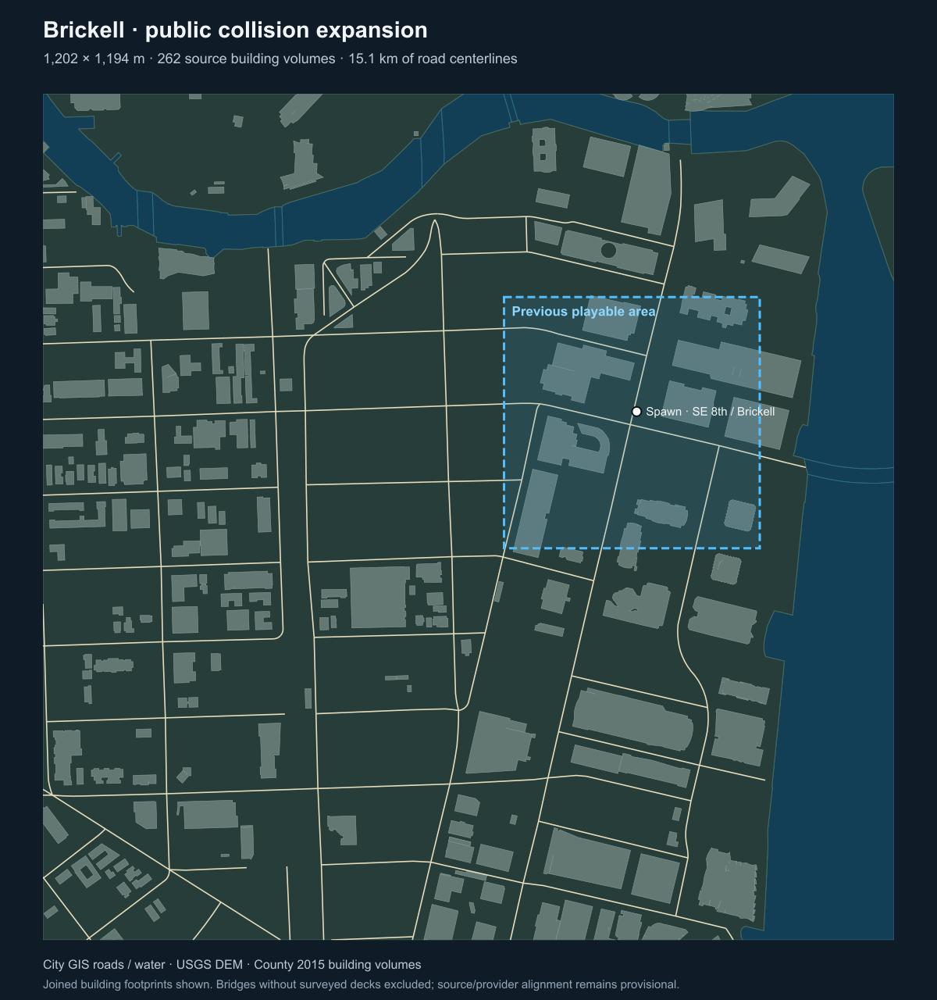

# Playable Miami checkpoint

The normal game entry streams Google Photorealistic 3D Tiles through Cesium ion into the existing Babylon scene. The player, vehicles, pedestrians, weapons, travel map and Havok simulation share that scene and camera. The standalone source viewer is no longer needed to play.

## Run

```sh
npm ci
npm run dev -- --port 4393 --strictPort
```

Open `http://127.0.0.1:4393/?backend=webgl` or `?backend=webgpu`. Connect the Google 3D Tiles asset with a Cesium ion token, then enter free roam. The token must permit asset 2275207 and the exact page origin. It stays in connection memory; disconnecting or reloading clears it. No credential is bundled, saved or committed. The existing local account connection has already been demonstrated in both rendering backends.

## Expanded Brickell area

- Approximately **1,202 × 1,194 metres**, expanded from 361 × 355 metres. Public source coverage contains about 1.205 km² of dry land, including a largest contiguous dry area of 1.129 km².
- **51 streamed collision chunks, 437 mesh colliders, 262 County source-building volumes, 130 clipped road pieces and 1,871 navigation nodes.** The source road centre lines span about 15.1 km.
- **34 named travel destinations**, plus map-point selection on supported dry ground. Teleports and save restoration wait for required collision packages before moving actors. Water and unsupported edge selections are rejected.
- Analytic swept body-radius checks protect the mapped shoreline and outer coverage edges, including high-speed movement and physics impulses. Tangential motion and vertical velocity are preserved.
- Traffic brakes at finite road ends. Downed actors and sleeping vehicles retain collision support. Existing R1 saves load into R2 without resetting character state; unrelated maps do not migrate automatically.
- Navigation searches nearby lane endpoints when the nearest lane is disconnected. Disconnected road destinations report “No road route” and remain available for supported fast travel.
- Packed public collision buffers have a 96 MiB cache target, with required active support allowed to exceed it. Optional prefetch yields to arrival and active-body requests; its failure no longer rejects valid travel. This target excludes Havok, GPU and other memory.
- Simulation, physics and gameplay input pause while required source visuals or collision support are unavailable. Camera look remains available during a visual hold.

The coordinate origin is latitude 25.7662, longitude -80.1907, ellipsoid height zero, with local axes East, Up and North. Public collision geometry is invisible; streamed provider imagery supplies appearance with provider credits displayed. See [the collision compiler](../../tools/miami-common-frame/README.md) for provenance and reproducible compilation.



## Verification and remaining work

The root suite passes 331 tests and the production build passes. Native travel checks cover all 34 named destinations, supported edge pins, rejection of 103 water pins, and 9,727 dry traffic-link samples. Independent swept-boundary and navigation audits and native collision measurements are retained in [checkpoint evidence](../evidence/miami-game-streamed-r2/verification.json). Normal browser entry, world map and travel outside the original area were exercised with live provider imagery.

This is not a complete or exact Miami replica. Photogrammetry contains blurred street detail, irregular trees and other captured-scene artifacts. Independent collision does not cover every visible object, and provider-surface alignment is not established. Outlying areas still need traffic and pedestrian population. Street-level appearance, performance and sustained stability remain below acceptance; one long-lived WebGPU session reported Chromium graphics errors after successful travel. WebGL remains an available rendering path.

The public sources have different dates: County building volumes are from 2015, terrain includes 2023/24 survey data and older fallback areas, and street metadata is separate. 62 source volumes lack a joined footprint; 390 footprint parts have no joined 3D volume. The provisional NAVD88 plus GEOID18 conversion leaves source realization and epoch unresolved, so metre-scale correspondence errors remain possible. Precise coordinate arithmetic is not proof of survey accuracy.

Unsupported bridge decks are excluded. There is no invented waterbed. Miami currently uses a temporary dry-ground boundary for all bodies, including aircraft; swimming, boats and flight over its waterways are unfinished. Other gameplay requirements, including complete physical props and realistic assets, remain open. Provider tiles are streamed for display; they are not stored in this repository or used to manufacture collision data.
